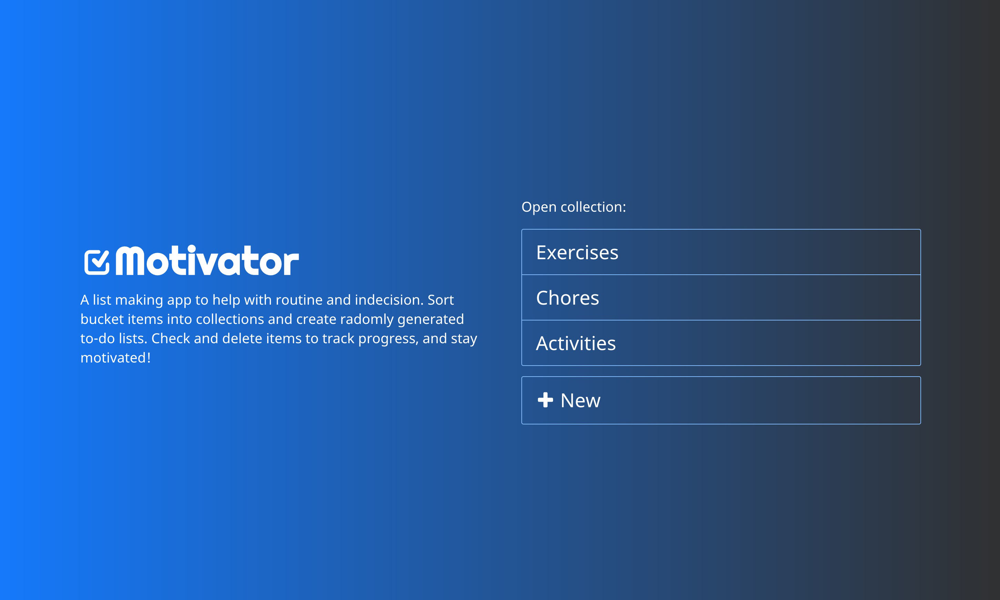
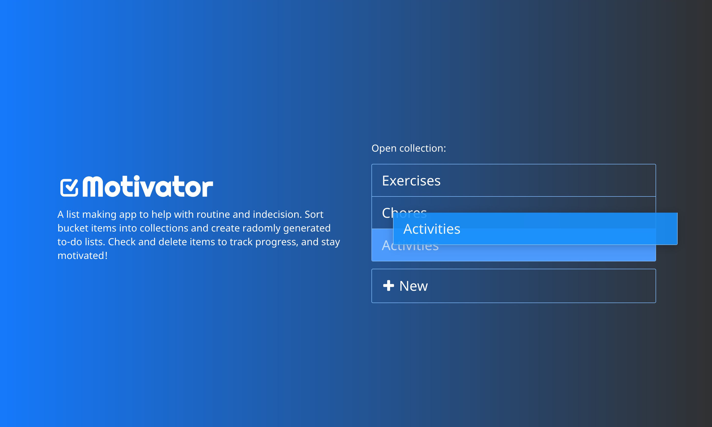
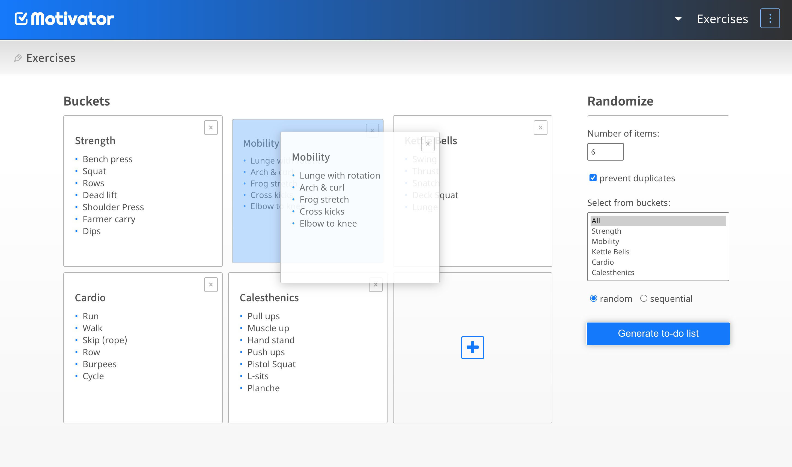
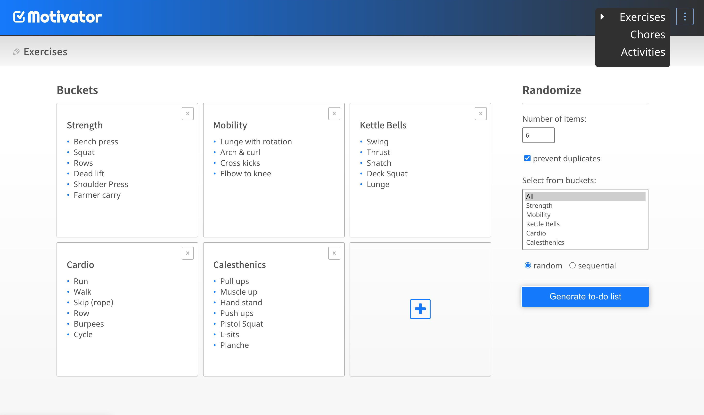
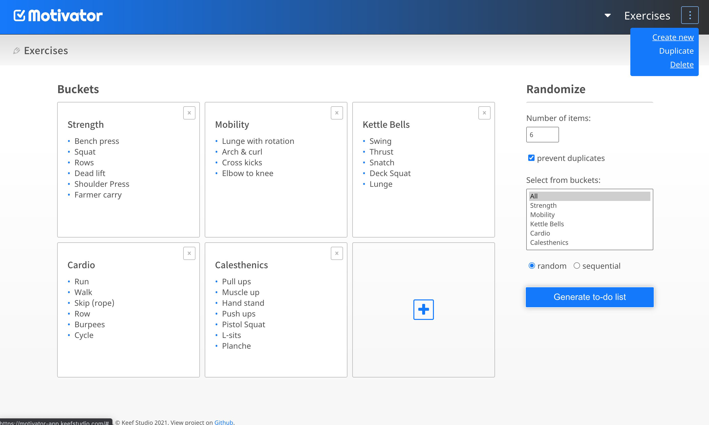
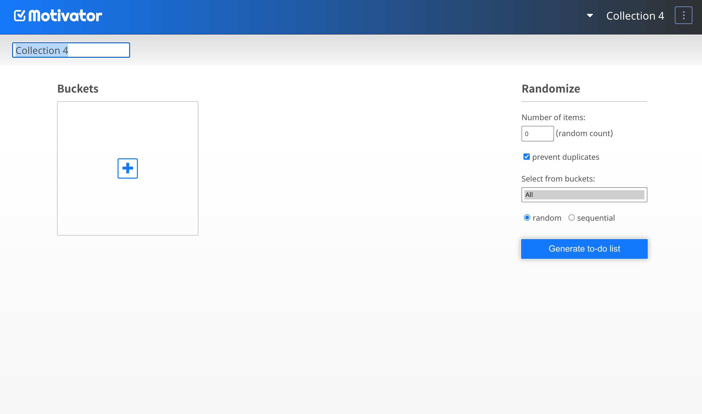
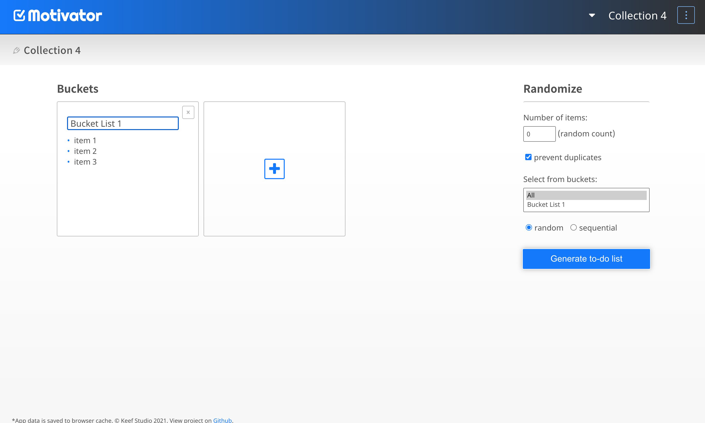
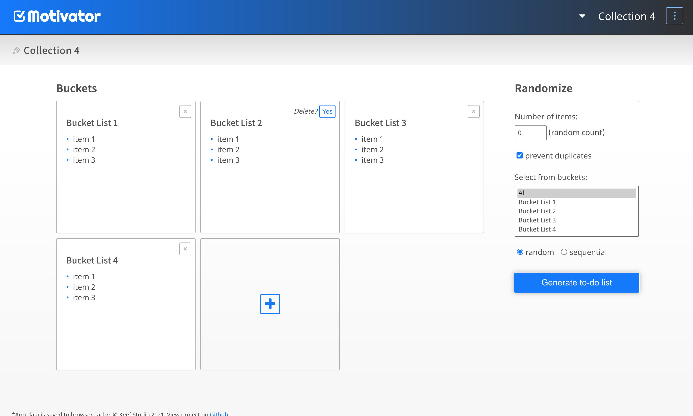
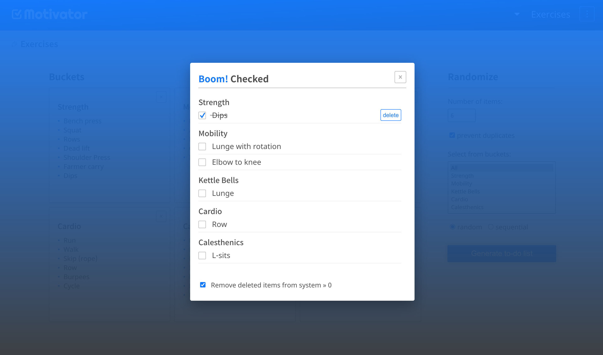
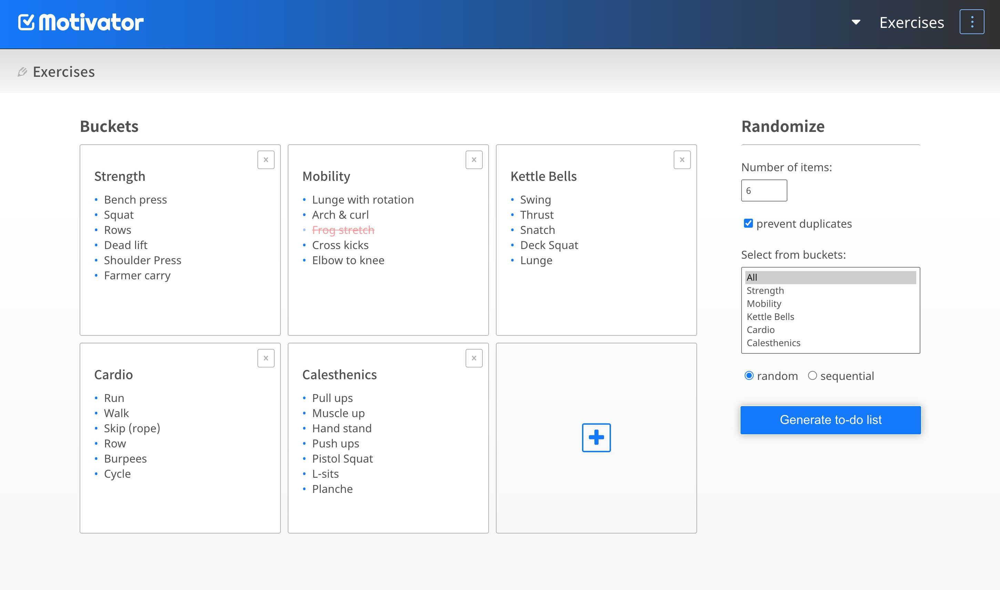

<!-- PROJECT LOGO -->
<br />
<p align="center">
  <a href="https://github.com/keefstudio/motivator">
    
  </a>

  <h1 align="center">Motivator App</h1>

  <p align="center"><a href="https://motivator-app.keefstudio.com">Open App</a>
    ·
    <a href="https://github.com/keefstudio/motivator/issues">Report Bug</a>
    ·
    <a href="https://github.com/keefstudio/motivator/issues">Request Feature</a>
    <br />
    <br />
    </p>

  <p align="center">
    A list making app to help with routine and indecision.
    Sort bucket items into collections and create radomly
    generated to-do lists. Check and delete completed items to watch your buckets emptied, and be more motivated!
    <br />
    <br />
    
  </p>
</p>
<br />

<!-- ABOUT THE PROJECT -->
## About The Project

A ground-up responsive design progressive web application project, built to be a living example of my work as a front-end developer. This app works with modern browsers and may also be installed as a standalone application on mobile devices. App data is saved to browser localstorage which will persist through sessions until browser cache is deleted.

The concept for this app is an experiment in motivation based on the idea that productivity is often hindered by decision-exhaustion and option-overload. By having to-do lists randomly generated&mdash;skipping the decision-making process, more energy is left for the tasks at hand.
<br />

### Built With
* [vue-cli](https://cli.vuejs.org/)
* [gsap](https://greensock.com/gsap/)
* [bootstrap-grid](https://www.npmjs.com/package/bootstrap-4-grid)
* [sass](https://sass-lang.com/)
<br />

<!-- USAGE EXAMPLES -->
## Usage
Demo content is provided on first run of the app. This content may be edited or deleted, and any changes will be saved. The app may be used as a standalone version by adding to homescreen via the popup banner (Android), or using the browser options menu (Android, iOS).
<br /><br />

### Welcome screen:
Click on the menu to open a Collection. The Collection menu can also be sorted from this screen. To sort, click and hold a menu item until it is highlighted, then drag and drop in place.  <a href="https://motivator-app.keefstudio.com" target="_blank">Open Motivator App</a>


<br /><br />

### Collection screen:
The Collection title can be edited by clicking on the title displayed at the top of the screen. Bucketes may be added to the collection using the "+" button. To sort the Buckets within the Collection, click and hold a bucket (without selecting a text area) unitl it scales down in size, then drag and drop in place.


<br /><br />

### Collections/Options menu:
Use the Collection menu to duplicate or delete the current collection, add a new collection, or display another.

 
<br /><br />

### Add New Collection/Bucket:
To add a new collection, click on the "+" icon. The Collection title, Bucket title and Task Items may be edited by clicking on them. When editing the Task Items each line created becomes a seperate task. To delete a Bucket, click on the "X" in the upper right corner, and confirm.



<br /><br />

### Randomize panel:
Options can be cofigured here to customize how To-do Lists are generated.



* **Number of items:** The number or items to be generated in the to-do list. Using "0" will generate a random number of items, between 1 and the number of available items.

* **Prevent duplicates:** This will ensure that no items are chosen more than once. If deselected, it is possible that the to-do list will contain duplicate items.

* **Select from buckets:** Choose one or more buckets from which items may be chosen to generate the to-list.

* **Random:** A random item will be chosen from a random bucket for each to-do item generated.

* **Sequential:** A random item will be chosen from each bucket (in order) for each to-do item generated.
<br /><br />

### To-do List window:
After clicking "Generate to-do list" a window will open containing the to-do list generated according to the Randomize setting specified. List items can be checked by clicking on them, and then deleted once checked. Deleted items will be removed from the To-do List window and also from the Bucket from which it was selected. When finished, click "X" to return to Collection screen.

* **Remove deleted items from system:** Unchecking this option will ensure that deleted to-do items will not also be deleted from Buckets


 
<br />

<!-- GETTING STARTED -->
## Developer Guide

To get a local copy up and running follow these simple steps.

### Prerequisites

This is an example of how to list things you need to edit the software and how to install them.
* npm
  ```sh
  npm install npm@latest -g
  ```

### Installation

1. Clone the repo
   ```sh
   git clone https://github.com/keefstudio/motivator.git
   ```
2. Install NPM packages
   ```sh
   cd motivator-app
   npm install
   ```
3. Run Project Locally
   ```sh
   npm run serve
   ```
<br /><br />

<!-- CONTACT -->
## Contact

Cameron O'Keefe - keefstudio@gmail.com

Project Link: [https://github.com/keefstudio/motivator](https://github.com/keefstudio/motivator)
